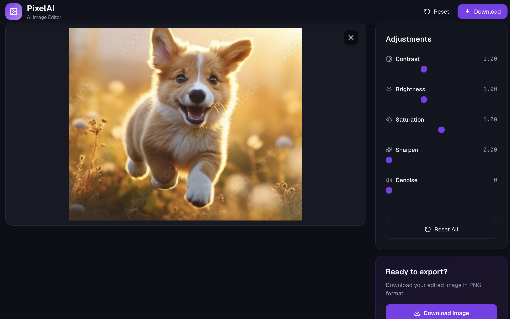
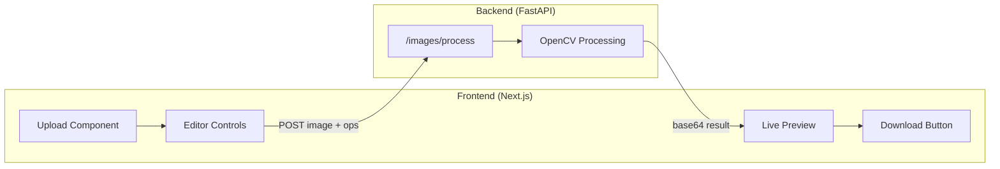

# PixelAI

> Browser-based image editor powered by OpenCV — upload, edit, download.



## Architecture



## Features

- **Drag & Drop Upload** — JPG, PNG, WebP, GIF
- **Real-time Adjustments** — Contrast, Brightness, Saturation, Sharpness, Denoise
- **Hold to Compare** — Click and hold to see original image
- **One-click Download** — Export as PNG

## Quick Start

### Backend

```bash
cd backend
pip install -r requirements.txt
uvicorn app.main:app --reload
```

Runs at `http://localhost:8000`

### Frontend

```bash
cd frontend
npm install
npm run dev
```

Runs at `http://localhost:3000`

## Project Structure

| Directory | Description |
|-----------|-------------|
| [`/frontend`](./frontend) | Next.js 14 + TailwindCSS |
| [`/backend`](./backend) | FastAPI + OpenCV |

## Tech Stack

- **Frontend**: Next.js 14, React, TailwindCSS, Lucide Icons
- **Backend**: FastAPI, OpenCV, NumPy
- **Processing**: opencv


## License

MIT

